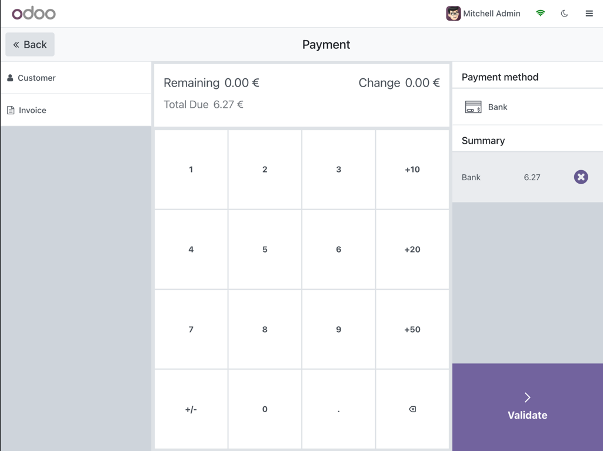

## Odoo 17.0 - Simple POS Theme
This is a Odoo 17.0 module that aims to make some small improvements on the
UI of the Odoo 17.0 `point_of_sale` module. As if right now, the module consist
of nothing fancy. However, it does make some noticeable changes to the general lay-out
of the POS system. 

### Tweaks
Some of the changes include:
- Lay-out of the product screen has been mirrored;
- Lay-out of the payment screen has been mirrored;
- Image visibility is improved for categories and products;
- Simplistic 'class-based' dark mode.

### Screenshots
Light Mode:

Dark Mode:

